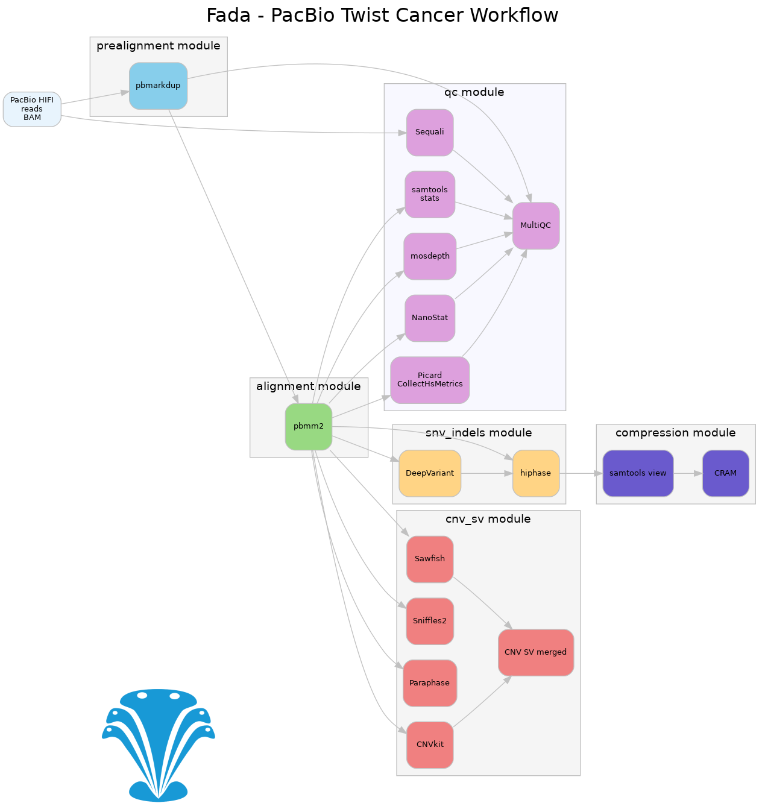
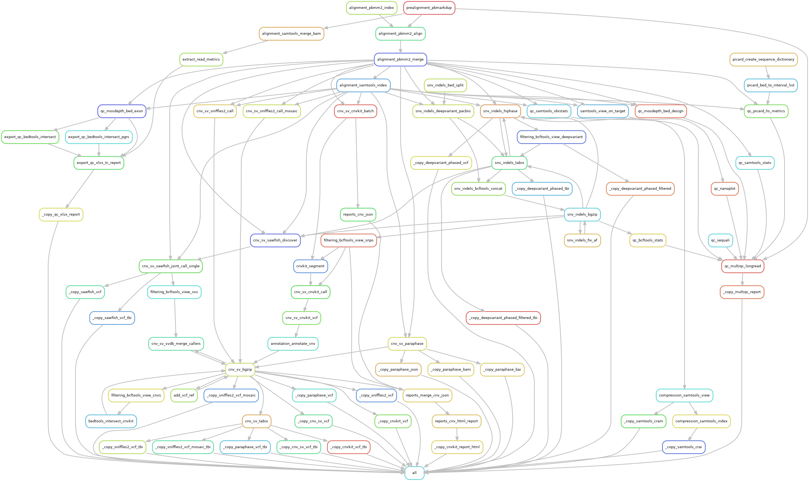

# PacBio Twist Cancer Panel 

## Workflow Overview

The following simplified workflow diagram shows the main data flow in the PacBio Twist Cancer panel analysis:



*Figure: Simplified workflow showing the main data flow from raw PacBio data through alignment (pbmm2) to variant calling tools and quality control metrics.*

### Complete Pipeline Rulegraph

For the complete view of all rules and dependencies:



*Figure: Complete workflow showing all dependencies between rules in the fada pipeline for PacBio Twist cancer workflow. Each node represents a rule, with arrows indicating data flow and dependencies.*

## Output Files

This document describes the output files generated by the PacBio Twist Cancer panel workflow. 
All results are organized under `results/{sample}/` with the following directory structure:

```
results/
├── {sample}/
│   ├── {sample}_coverage_report.xlsx  # excel coverage report
│   ├── cram/                          # Alignment file
│   ├── snv_indels/                    # Small variant calls
│   ├── cnv_sv/                        # Copy number and structural variants
│   └── paraphase/                     # Paralog-specific variant analysis
├── multiqc_pacbio_twist_cancer.html   # Quality control report
```

## Alignment Files (CRAM)

### Compressed Alignment Files
- **File**: `results/{sample}/cram/{sample}.cram`
- **Description**: Compressed alignment file containing mapped reads in CRAM format

- **File**: `results/{sample}/cram/{sample}.cram.crai`
- **Description**: Index file for the CRAM file

## Small Variant Files (SNVs & Indels)

### Hard-Filtered Variants
- **File**: `results/{sample}/snv_indels/{sample}.hard-filtered.vcf.gz`
- **Description**: Phased  SNVs and indels in VCF
- **Filter**: PASS variants only

- **File**: `results/{sample}/snv_indels/{sample}.hard-filtered.vcf.gz.tbi`
- **Description**: Tabix index for the hard-filtered VCF


### Soft-Filtered Variants (with Phasing)
- **File**: `results/{sample}/snv_indels/{sample}.deepvariant.soft-filtered.vcf.gz`
- **Description**: Phased DeepVariant SNV and INDEL calls, includes RefCalls

- **File**: `results/{sample}/snv_indels/{sample}.deepvariant.soft-filtered.vcf.gz.tbi`
- **Description**: Tabix index for the soft-filtered VCF


## Copy Number Variants & Structural Variants

### Merged CNV/SV Calls
- **File**: `results/{sample}/cnv_sv/{sample}.cnv_sv.vcf.gz`
- **Description**: Combined CNV and SV calls from Sawfish and CNVkit (SVDB merged)
- **Callers**: Integrated results from CNVkit, Sawfish, and Sniffles2

- **File**: `results/{sample}/cnv_sv/{sample}.cnv_sv.vcf.gz.tbi`
- **Description**: Tabix index for the merged CNV/SV VCF

### CNVkit Results
- **File**: `results/{sample}/cnv_sv/{sample}.cnvkit.vcf.gz`
- **Description**: Large Copy number variants called by CNVkit with gene annotations

- **File**: `results/{sample}/cnv_sv/{sample}.cnvkit.vcf.gz.tbi`
- **Description**: Tabix index for the CNVkit VCF

- **File**: `results/{sample}/cnv_sv/{sample}.cnv_report.html`
- **Description**: Interactive HTML report showing CNV analysis results

### Sawfish Results
- **File**: `results/{sample}/cnv_sv/{sample}.sawfish.vcf.gz`
- **Description**: Structural variants called by Sawfish

- **File**: `results/{sample}/cnv_sv/{sample}.sawfish.vcf.gz.tbi`
- **Description**: Tabix index for the Sawfish VCF

### Sniffles2 Results
- **File**: `results/{sample}/cnv_sv/{sample}.sniffles2.vcf.gz`
- **Description**: Structural variants called by Sniffles2

- **File**: `results/{sample}/cnv_sv/{sample}.sniffles2.vcf.gz.tbi`
- **Description**: Tabix index for the Sniffles2 VCF

### Sniffles2 Mosaic Variants
- **File**: `results/{sample}/cnv_sv/{sample}.sniffles2.mosaic.vcf.gz`
- **Description**: Low-frequency mosaic structural variants detected by Sniffles2

- **File**: `results/{sample}/cnv_sv/{sample}.sniffles2.mosaic.vcf.gz.tbi`
- **Description**: Tabix index for the mosaic Sniffles2 VCF

## Paraphase Analysis (Paralog-Specific Variants)

### Alignment Files
- **File**: `results/{sample}/paraphase/{sample}.paraphase.bam`
- **Description**: Paraphase-processed alignment file with paralog assignment

- **File**: `results/{sample}/paraphase/{sample}.paraphase.bam.bai`
- **Description**: Index file for the Paraphase BAM

### Analysis Results
- **File**: `results/{sample}/paraphase/{sample}.paraphase.json`
- **Description**: Detailed Paraphase analysis results in JSON format

### Gene-Specific VCFs
- **File**: `results/{sample}/paraphase/{sample}.paraphase.{gene}.vcf.gz`
- **Description**: Paralog-specific variant calls for individual genes
- **Genes**:
    - pms2

- **File**: `results/{sample}/paraphase/{sample}.paraphase.{gene}.vcf.gz.tbi`
- **Description**: Tabix index for gene-specific Paraphase VCFs

## Quality Control & Reports

### MultiQC Report
- **File**: `results/multiqc_pacbio_twist_cancer.html`
- **Description**: Comprehensive quality control report aggregating metrics across all samples
- **Content**: 
  - Read quality metrics
  - Alignment statistics
  - Coverage analysis
  - Variant calling metrics
  - Sample comparison plots

### Coverage Report
- **File**: `results/{sample}/{sample}_coverage_report.xlsx`
- **Description**: Detailed coverage analysis report in Excel format
- **Use**: Per-sample coverage assessment for clinical reporting
- **Content**:
  - Target region coverage statistics
  - Per-gene coverage metrics
  - PGRS coverage analysis
  - Exon-level coverage details

